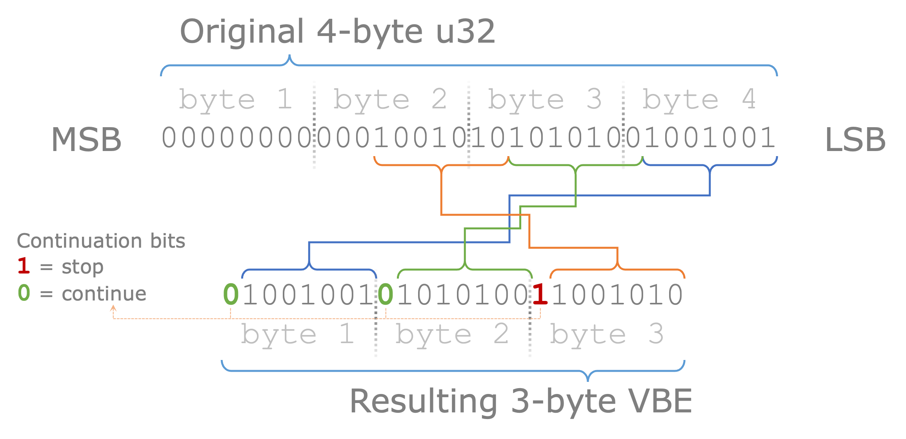

# `vbe-rs` – A Variable Byte Encoding Rust Library

This Rust library provides functionality for Variable Byte Encoding (VBE), a form of lossless data compression that is commonly used for encoding integers in a way that results in smaller output size for smaller numbers. This is particularly useful in applications such as databases and indexes, where many numbers may be small and memory efficiency is important.

## Usage

To use this library in your Rust project, add the following to your `Cargo.toml` file:

```toml
[dependencies]
vbe = { git = "https://github.com/bazzilic/vbe-rs", tag = "v0.1.1" }
```

Then, import the `vbe` module in your Rust code:

```rust
use vbe::{encode, decode};
```

The `encode` function takes a reference to an unsigned integer and returns a `Vec<u8>` containing the VBE representation of the number:

```rust
let number: u128 = 123456789;
let encoded = vbe::encode(&number);
```

The `decode` function takes an iterator over `u8` (such as a `Vec<u8>` or a slice) and returns a `Result<u128, String>`. If the input is a valid VBE representation of a number, `decode` will return `Ok(number)`. If the input is not valid (for example, if it ends in the middle of a number), `decode` will return an `Err` with an error message:

```rust
let encoded: Vec<u8> = vec![...]; // some VBE-encoded bytes
match vbe::decode(encoded.into_iter()) {
    Ok(number) => println!("The number is {}", number),
    Err(err) => println!("Failed to decode: {}", err),
}
```

Note that `decode` mutates and advances the iterator. This way, if you have multiple VBE-encoded numbers in a byte array, you can continue calling ``decode` using the same iterator to decode the numbers one by one.

## Testing

The library comes with unit tests for the `encode` and `decode` functions. You can run these tests using the command `cargo test`.

## VBE format



## Contributing

Contributions to this project are welcome. Please feel free to submit a pull request or open an issue on the project's GitHub page.

## License

This project is licensed under the MIT license. See the LICENSE file for more details.
